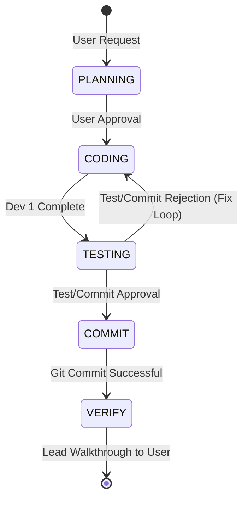

# GEMINI.md - ngombor-pages

## Project Identity & Philosophy
- **Identity**: A premium, highly interactive single-page microsite for the **Ngombor Community Development Alliance (NGOCDA)**.
- **Goal**: Showcase NGOCDA's integration of permaculture (sustainable agriculture) and technology (IT literacy) in Nebbi, Uganda, driving awareness and facilitating donations.
- **Design Philosophy (Earth-Tech Fusion)**: 
  - Earthy tones (deep forest green, warm clay, sand) blended with high-tech accents (cyber sky blue, delicate neon networks).
  - Modern geometric typography, rich glassmorphic layers, and interactive hover states.

## Technical Stack & Constraints
- **Runtime & Deployment**: Cloudflare Pages for lightning-fast, edge-distributed global static delivery.
- **Languages**: Semantic HTML5, Vanilla CSS (with HSL design tokens), and Vanilla JS for micro-interactions and dark mode.
- **CI/CD Pipeline**: GitHub Actions triggered on pushes to `main`, deploying directly via `cloudflare/pages-action`.
- **Local Dev Server**: Fast, lightweight dev environment using local Node scripts (e.g., standard file serving).

## Architectural Patterns
- **Directory Layout**:
  - `public/`: Directory containing static production files (`index.html`, `styles.css`, `app.js`).
  - `.github/workflows/`: Deploy workflows for production.
- **CSS Architecture**: Functional CSS utilizing central CSS Variables (custom properties) in `styles.css`. Responsive layouts driven by CSS Grid and Flexbox, with standard media queries.
- **Accessibility & SEO**: Strict adherence to accessible semantic HTML (nav, main, section, header) and optimal layout flow for both desktop, mobile, and screen-readers.

## Agent Team, Roles & Orchestration
This project utilizes the standard 3-agent orchestration pattern developed for efficient, error-free automated engineering:

### 1. Lead Agent (Antigravity)
- **Role**: Architectural Gatekeeper, Plan Coordinator, and User Liaison.
- **Focus**: Maintain high standards of semantic HTML, design aesthetics, and SEO optimization. Programmatically orchestrate the subagents and compile task deliverables.

### 2. Dev 1 (Surgical Coder)
- **Role**: High-precision static developer.
- **Focus**: Implement surgical frontend changes and configurations without introducing code bloat or unnecessary dependencies. Maintain clean documentation and HSL styling compliance.

### 3. Test/Commit (Quality & Git)
- **Role**: Skeptical Quality Assurance inspector and Git custodian.
- **Focus**: Validate code syntax locally using node checkers. Verify responsive properties, links, and CI/CD yaml syntax before staging surgically (`git add <file>`) and committing using conventional prefixes (`feat()`, `fix()`, `docs()`, `chore()`).
